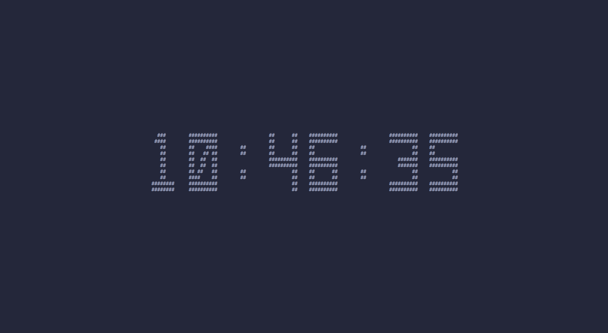
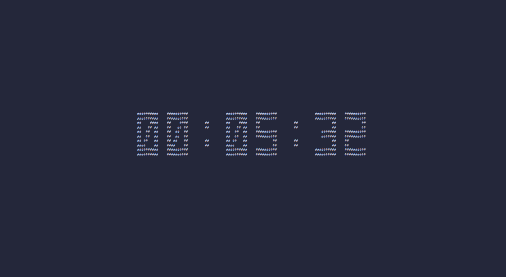

# Introduction

This program is a terminal clock written in C with a ncurses tui and performances efficient.


# Usage

Simply run `./tClock` with `s` option to display seconds and/or `b` to display bold numbers.

> To display both bold numbers and seconds: `./tClock b s`




# Chronometer

`./tClock t` combined with `s` and/or `b` option runs tClock on chronometer mode. Hit the spacebar in order to start/stop the chronometer. 




**Hit `q` or `Q` to quit.**


# Re-compiling

Use your favorite compiler (here cc):
```sh
cc src/main.c src/display.c -o tClock -lncurses
```
in the project's root directory.
